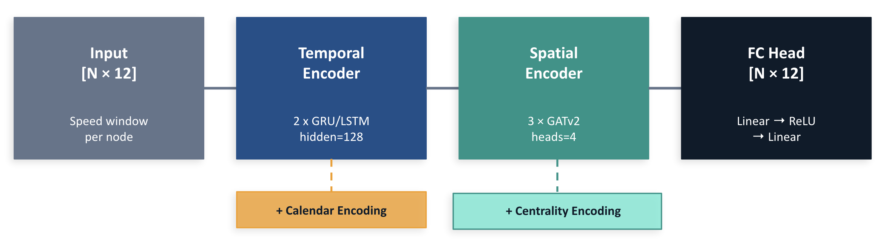

# spatiotemporal-traffic-forecasting
Predicting Traffic Congestion Using Spatio-Temporal Graph Neural Networks

> A systematic bottom-up study of spatiotemporal GNN architectures for short-term traffic speed forecasting on METR-LA and PEMS-BAY.

## Overview

Urban traffic congestion propagates across interconnected road networks in ways that purely temporal models cannot capture. Rather than proposing a single complex model, this project takes an **incremental architectural approach** — empirically validating each design decision before inclusion, providing clear evidence for why spatio-temporal GNNs work.

**Key finding:** Replacing static GCN aggregation with attention-weighted GATConv yields a **37% MAE reduction** — the single largest architectural gain in the study.

---

## Results

### Incremental Modelling Study (METR-LA, H=12)

| # | Model | Key Change | MAE | RMSE | Δ |
|---|-------|-----------|-----|------|---|
| 1 | Temporal Baseline (LSTM) | Time only, no graph | 4.55 | 7.02 | — |
| 2 | Spatial Baseline (GCN) | Graph only, no sequence | 6.01 | 9.10 | ↓ worse |
| 3 | LSTM + GCN | Combined, temporal-first | 5.45 | 8.31 | ↑ better |
| **4** | **LSTM + GATConv (Best)** | **GCN → GATv2** | **3.42** | **6.80** | **+37%** |
| 5 | ST + Transformer | LSTM → Transformer | 3.46 | 6.86 | marginal |
| 6 | ST + Feature Engineering | + Calendar/Centrality | ~3.45 | ~6.80 | marginal |

### Comparison with State-of-the-Art (H=12, 60-minute horizon)

| Dataset | Method | MAE | RMSE | MAPE |
|---------|--------|-----|------|------|
| **METR-LA** | FC-LSTM | 4.37 | 8.69 | 14.00 |
| | DCRNN | 3.60 | 7.60 | 10.50 |
| | STGCN | 4.59 | 9.40 | 12.70 |
| | Graph WaveNet | 3.53 | 7.37 | 10.01 |
| | STAEformer | 3.34 | 7.02 | 9.70 |
| | T-Graphormer (SOTA) | 3.19 | 6.12 | 8.62 |
| | **LSTM + GATConv (Ours)** | **3.42** | **6.80** | **9.20** |
| **PEMS-BAY** | FC-LSTM | 2.37 | 4.96 | 5.70 |
| | DCRNN | 2.07 | 4.74 | 4.90 |
| | Graph WaveNet | 1.95 | 4.54 | 4.63 |
| | STAEformer | 1.88 | 4.34 | 4.41 |
| | T-Graphormer (SOTA) | 1.63 | 3.20 | 3.65 |
| | **LSTM + GATConv (Ours)** | **1.87** | **4.27** | **4.18** |

Our best model outperforms Graph WaveNet on both datasets. The gap to T-Graphormer is attributable to its significantly larger architecture and training budget.

---

## Methodology

### Problem Setup
- **Input:** 12 historical speed readings per sensor (60 min at 5-min resolution)
- **Output:** Predicted speeds at H=3 (15 min), H=6 (30 min), H=12 (60 min)
- **Graph:** Sensors as nodes, road connections as weighted edges (Gaussian kernel on distance)

### Architecture
The best model is a **temporal-first spatio-temporal GNN**:
1. **LSTM encoder** processes each sensor's 12-step speed history independently
2. **GATv2Conv** aggregates the resulting embeddings across road-network neighbors using learned attention weights

The temporal-first ordering is deliberate — spatial aggregation before temporal encoding allows raw neighbour noise to corrupt the temporal signal.

### Training
- **Loss:** Huber loss (δ=1.0) for outlier robustness
- **Optimizer:** AdamW (lr=1e-3) with ReduceLROnPlateau scheduler
- **Early stopping:** patience=5 epochs
- **Architecture:** hidden dim 192, 3 GATv2 layers, 2 LSTM layers, dropout=0.1
- **Batch size:** 64, up to 50 epochs
- **Experiment tracking:** MLflow (hyperparameters, training curves, checkpoints)

### Data Preprocessing
- Missing values: bidirectional linear interpolation
- Train/val/test split: 70:10:20 (chronological, no leakage)
- Normalization: Z-score using train set statistics only
- ~24,000 training samples for METR-LA; ~36,000 for PEMS-BAY

---

## Datasets

| Feature | METR-LA | PEMS-BAY |
|---------|---------|----------|
| Location | Los Angeles, CA | SF Bay Area, CA |
| Time Period | Mar–Jun 2012 | Jan–May 2017 |
| Sensors | 207 | 325 |
| Edges | 1,515 | 2,369 |
| Graph Sparsity | 96.4% | 97.8% |
| Mean Speed (mph) | 58.46 | 62.62 |
| Speed Std Dev | 13.02 | 9.59 |
| Missing Data | 8.11% | ~0% |

Download from Google Drive: [Link](https://drive.google.com/drive/u/1/folders/1c2CUuWjWFw2FAq2aJSA7rqDCM01sIV7z)

Place `datasets` folder in project root directory.
---

## Repo Structure

```
spatiotemporal-traffic-forecasting/
├── notebooks/          # Jupyter notebooks for EDA and experiments
├── src/                # Model definitions and training code
├── app/                # Application/demo code
├── docs/               # Project report and documentation
├── main.py             # Entry point
├── pyproject.toml      # Dependencies (Python ≥ 3.12.3)
└── Dockerfile          # Container setup
```

---

## Installation

**Using uv (recommended):**
```bash
git clone https://github.com/hassaanmuzammil/spatiotemporal-traffic-forecasting.git
cd spatiotemporal-traffic-forecasting
uv sync
```

## Environment Setup

This project uses [uv](https://docs.astral.sh/uv/) for dependency management.

**Prerequisites:** Python version is pinned in `.python-version` — uv handles this automatically.
```bash
# install uv
curl -LsSf https://astral.sh/uv/install.sh | sh

# install dependencies and create virtual environment
uv sync

# activate virtual environment
source .venv/bin/activate        # mac/linux
.venv\Scripts\activate           # windows
```

All dependencies and their exact versions are locked in `uv.lock` for reproducible environments across platforms.


## Train
Set [Config](../src/configs/config.py) and run trainer.
```bash
cd spatiotemporal-traffic-forecasting
python -m src.trainer
```

To run mlflow server: 
```bash
mlflow ui --backend-store-uri ./mlruns
```
Navigate to http://localhost:5000 for UI.


## Key Findings

1. **Temporal beats spatial in isolation.** LSTM alone (MAE 4.55) significantly outperforms GCN alone (MAE 6.01). Rush-hour patterns provide stronger signal than road topology without time context.

2. **GATv2 attention is the critical component.** Replacing GCN with GATv2 reduces MAE from 5.45 → 3.42 (37% improvement). Learned asymmetric attention captures which neighbors actually matter — fixed equal-weight averaging does not.

3. **Transformers don't help at this scale.** Full self-attention over 12 timesteps is over-parameterized. LSTM + GATv2 matches or beats the Transformer variant while being computationally cheaper.

4. **Feature engineering is redundant.** Calendar and centrality features added negligible improvement, suggesting GATv2 already implicitly encodes structural and temporal context from speed history alone.

---

## References

- Li et al., *DCRNN: Diffusion Convolutional Recurrent Neural Network*, ICLR 2018
- Wu et al., *Graph WaveNet*, IJCAI 2019
- Chen et al., *T-Graphormer*, 2023
- Brody et al., *How Attentive are Graph Attention Networks?*, ICLR 2022
- Fey & Lenssen, *PyTorch Geometric*, ICLR Workshop 2019

---

## Overall Architecture



## License

MIT
